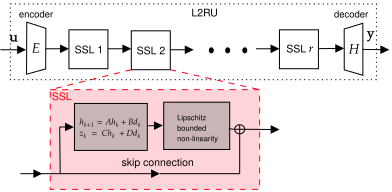

# neural-ssm

PyTorch implementations of state-space models (SSMs) with a built-in robustness certificate in the form of a tunable L2-bound. 
This is obtained by using:

- free parametrizations of L2-bounded linear dynamical systems
- Lipschitz-bounded static nonlinearities

The mathematical details are in:

- **Free Parametrization of L2-bounded State Space Models**  
  https://arxiv.org/abs/2503.23818

## Installation

Install from pip:

```bash
pip install neural-ssm
```

Install the latest GitHub version:

```bash
pip install git+https://github.com/LeoMassai/neural-ssm.git
```

## Architecture and robustness recipe
Let's see what an SSM is more in detail 



Reading the figure from left to right:

1. Input is projected by a linear encoder.
2. A stack of SSL blocks is applied.
3. Each block combines:
   - a dynamic recurrent core with different state-space parametrizations (`lru`, `l2n`, or `tv`)
   - a static nonlinearity (`LGLU`, `LMLP`, `GLU`, ...)
   - a residual connection.
4. Output is projected by a linear decoder.

Main message: `l2n` and `tv`, when used with a Lipschitz-bounded nonlinearity such as `LGLU`, enable robust deep SSMs with prescribed L2 bound.

## Main parametrizations

- `lru`: inspired by "Resurrecting Linear Recurrences"; parametrizes all and only stable LTI systems.
- `l2n`: free parametrization of all and only LTI systems with a prescribed L2 bound.
- `tv`: free parametrization of a time-varying selective recurrent unit with prescribed L2 bound (paper in preparation).

All these parametrizations support both forward execution modes:

- parallel scan via `mode="scan"` (tipically very fast for long sequences)
- standard recurrence loop via `mode="loop"`

You select the mode at call time, e.g. `model(u, mode="scan")` or `model(u, mode="loop")`.

## Main SSM parameters

The SSM model is implemented by the class DeepSSM, which takes a number of input parameters, here are the most important ones:

- `d_input`: input feature dimension.
- `d_output`: output feature dimension.
- `d_model`: latent model dimension used inside each SSL block.
- `d_state`: internal recurrent state dimension.
- `n_layers`: number of stacked SSL blocks.
- `param`: parametrization of the recurrent unit (`lru`, `l2n`, `tv`, ...).
- `ff`: static nonlinearity type, same for each SSL block (`GLU`, `MLP`, `LMLP`, `LGLU`, `TLIP`).
- `gamma`: desired L_2 bound of the overall SSM. If `gamma=None`, it is trainable.

## Where each component is in the code

- End-to-end wrapper (encoder, stack, decoder):  
  `DeepSSM` in `src/neural_ssm/ssm/lru.py`
- Repeated SSM block (dynamic core + nonlinearity + residual):  
  `SSL` in `src/neural_ssm/ssm/lru.py`
- Dynamic cores:
  - `lru` -> `LRU` in `src/neural_ssm/ssm/lru.py`
  - `l2n` -> `Block2x2DenseL2SSM` in `src/neural_ssm/ssm/lru.py`
  - `tv` -> `RobustMambaDiagSSM` in `src/neural_ssm/ssm/mamba.py`
- Static nonlinearities:
  - `GLU`, `MLP` in `src/neural_ssm/static_layers/generic_layers.py`
  - `LGLU`, `LMLP`, `TLIP` in `src/neural_ssm/static_layers/lipschitz_mlps.py`
- Parallel scan utilities:  
  `src/neural_ssm/ssm/scan_utils.py`

## Quick tutorial

For a complete, runnable training example on a nonlinear benchmark dataset, see:
`Test_files/Tutorial_DeepSSM.py`

For a minimal Long Range Arena (LRA) benchmark script (ListOps) using `DeepSSM`, see:
`scripts/run_lra_listops.py` (requires `pip install datasets`). The script defaults to
the Hugging Face dataset `lra-benchmarks` with config `listops`.

### Tensor shapes and forward outputs

- Input tensor shape is `u: (B, L, d_input)` where:
  - `B` = batch size
  - `L` = sequence length
  - `d_input` = input dimension
- Output tensor shape is `y: (B, L, d_output)`.
- `DeepSSM` returns two objects:
  - `y`: the model output sequence 
  - `state`: a list of recurrent states (one tensor per SSL block), useful for stateful calls.

State handling in `forward` (DeepSSM and recurrent cores):

- `state`: optional explicit initial state (or state list for `DeepSSM`).
- `reset_state`: defaults to `True`.
  - `True`: start from zero state for this call.
  - `False`: reuse internal state if `state` is not provided.
- `detach_state`: defaults to `True`.
  - `True`: internal state is detached at the end of the call (no cross-call BPTT).
  - `False`: internal state keeps gradient history (for true BPTT across calls).
- `reset()`: manually resets internal state to zero.

### How to create and call a Deep SSM 

Building and using the SSM is pretty easy:

```python
import torch
from neural_ssm import DeepSSM

model = DeepSSM(
    d_input=1,
    d_output=1,
    d_model=16,
    d_state=16,
    n_layers=4,
    param="tv",
    ff="LGLU",
    gamma=2.0,
)

u = torch.randn(8, 200, 1)               # (B, L, d_input)
y, state = model(u, mode="scan")         # reset_state=True by default

# Stateful call: pass one state per SSL block
u_next = torch.randn(8, 200, 1)
y_next, state = model(u_next, state=state, mode="scan", reset_state=False)

# Stateful call without passing explicit state (reuse internal state)
y_stream, state = model(u_next, mode="scan", reset_state=False)

# True BPTT across calls: keep state in graph
y_bptt, state = model(u_next, mode="scan", reset_state=False, detach_state=False)
```

## Top-level API

- `DeepSSM`, `SSMConfig`
- `LRU`, `L2RU`, `lruz`
- static layers re-exported in `neural_ssm.layers`

## Examples

Example and experiment scripts are available in `Test_files/`, including:
- `Test_files/Tutorial_DeepSSM.py`: minimal end-to-end DeepSSM training tutorial.

## Citation

If you use this repository in research, please cite:

**Free Parametrization of L2-bounded State Space Models**  
https://arxiv.org/abs/2503.23818
