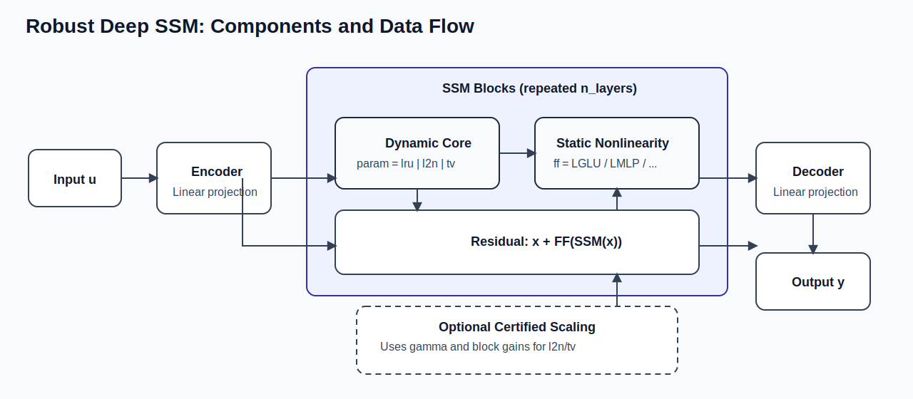

# neural-ssm

PyTorch implementations of robust neural state-space models (SSMs), centered on:

- free parametrizations of L2-bounded linear dynamical systems
- Lipschitz-bounded static nonlinearities for robust deep SSM design

The mathematical details are in:

- **Free Parametrization of L2-bounded State Space Models**  
  https://arxiv.org/abs/2503.23818

## Installation

Install from pip:

```bash
pip install neural-ssm
```

Install the latest GitHub version:

```bash
pip install git+https://github.com/LeoMassai/neural-ssm.git
```

## Architecture and robustness recipe



Reading the figure from left to right:

1. Input is projected by an encoder.
2. A stack of SSL blocks is applied.
3. Each block combines:
   - a dynamic core (`lru`, `l2n`, or `tv`)
   - a static nonlinearity (`LGLU`, `LMLP`, `GLU`, ...)
   - a residual connection.
4. Output is projected by a decoder.
5. For `l2n`/`tv`, optional certified scaling with `gamma` is used to preserve prescribed L2 robustness behavior.

Main message: `l2n` and `tv`, when used with a Lipschitz-bounded nonlinearity such as `LGLU`, enable robust deep SSMs with prescribed L2 bound.

## Main parametrizations

- `lru`: inspired by "Resurrecting Linear Recurrences"; efficient and stable linear recurrent backbone.
- `l2n`: SSM with prescribed L2 bound via free parametrization.
- `tv`: time-varying selective SSM with prescribed L2 bound (paper in preparation).

All these parametrizations support both forward execution modes:

- parallel scan via `mode="scan"`
- standard recurrence loop via `mode="loop"`

You select the mode at call time, e.g. `model(u, mode="scan")` or `model(u, mode="loop")`.

## Where each component is in the code

- End-to-end wrapper (encoder, stack, decoder):  
  `DeepSSM` in `src/neural_ssm/ssm/lru.py`
- Repeated SSM block (dynamic core + nonlinearity + residual):  
  `SSL` in `src/neural_ssm/ssm/lru.py`
- Dynamic cores:
  - `lru` -> `LRU` in `src/neural_ssm/ssm/lru.py`
  - `l2n` -> `Block2x2DenseL2SSM` in `src/neural_ssm/ssm/lru.py`
  - `tv` -> `RobustMambaDiagSSM` in `src/neural_ssm/ssm/mamba.py`
- Static nonlinearities:
  - `GLU`, `MLP` in `src/neural_ssm/static_layers/generic_layers.py`
  - `LGLU`, `LMLP`, `TLIP` in `src/neural_ssm/static_layers/lipschitz_mlps.py`
- Parallel scan utilities:  
  `src/neural_ssm/ssm/scan_utils.py`

## Quick tutorial

### A) Create a model using `SSMConfig`

```python
import torch
from neural_ssm import DeepSSM, SSMConfig

cfg = SSMConfig(
    d_model=16,
    d_state=16,
    n_layers=4,
    param="l2n",      # lru | l2n | tv | ...
    ff="LGLU",        # GLU | MLP | LMLP | LGLU | TLIP
    gamma=2.0,
    train_gamma=False,
)

model = DeepSSM(d_input=1, d_output=1, config=cfg)
u = torch.randn(8, 200, 1)               # (batch, time, input_dim)
y, state = model(u, mode="scan")         # or mode="loop"
```

### B) Create a model with direct constructor arguments

```python
import torch
from neural_ssm import DeepSSM

model = DeepSSM(
    d_input=1,
    d_output=1,
    d_model=16,
    d_state=16,
    n_layers=4,
    param="tv",
    ff="LGLU",
    gamma=2.0,
    train_gamma=False,
)

u = torch.randn(8, 200, 1)
y, state = model(u, mode="scan")
```

## Top-level API

- `DeepSSM`, `SSMConfig`
- `LRU`, `L2RU`, `lruz`, `PureLRUR`, `SimpleRNN`
- static layers re-exported in `neural_ssm.layers`

## Examples

Example and experiment scripts are available in `Test_files/`.

## Citation

If you use this repository in research, please cite:

**Free Parametrization of L2-bounded State Space Models**  
https://arxiv.org/abs/2503.23818


