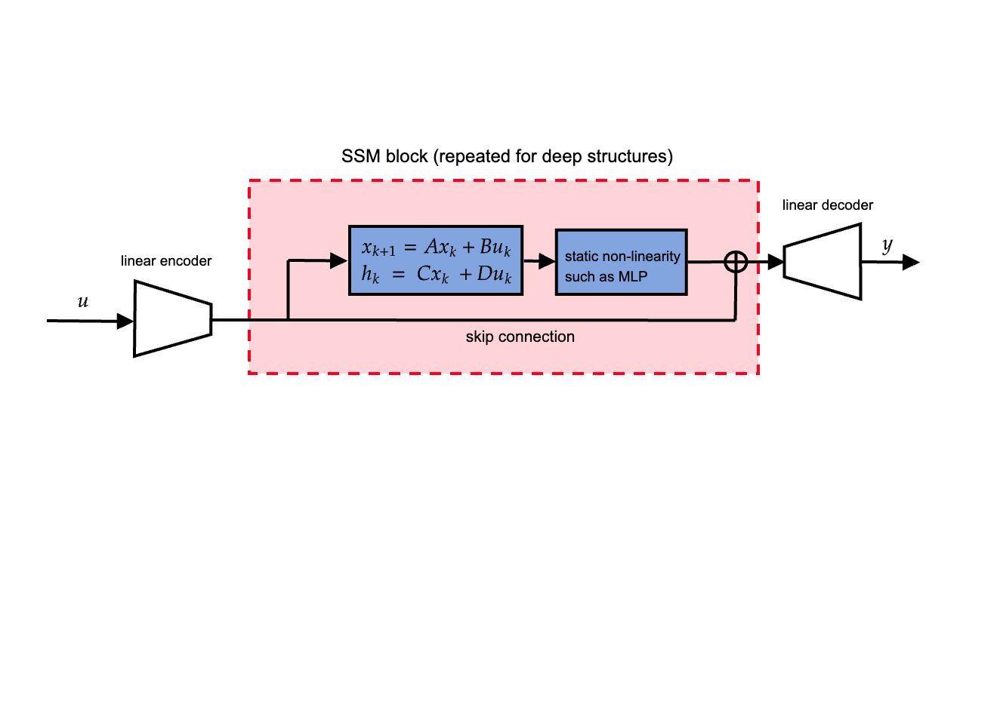

# Pytorch LRU with l2 stability guarantees

A PyTorch implementation of DeepMind's [Linear Recurrent Unit](https://arxiv.org/pdf/2303.06349) (LRU). Application in System Identification included as example.

## LRU block
The LRU block is a discrete-time linear time-invariant system implemented in state-space form as:
```math
\begin{align}
x_{k} = Ax_{x-1} + B u_k\\
y_k = C x_k + D u_k,
\end{align}
```
Two parametrizations are provided for the matrices ```(A, B, C, D)```, both of them guarantee the stability of the system.
Moreover, the use of [parallel scan algorithms](https://en.wikipedia.org/wiki/Prefix_sum) makes execution extremely fast on modern hardware in non-core-bound scenarios.

## Deep LRU Architecture

LRU units are typically organized in a deep LRU architecture like:



