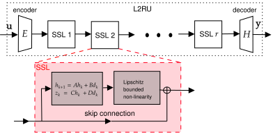
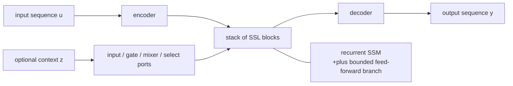

# neural-ssm

**Robust neural state-space models in PyTorch.** `neural-ssm` combines recurrent
state-space layers, bounded nonlinearities, and optional context-aware routing to
build sequence models with an explicit zero-state input/output `L2`-gain bound.

It is useful when a model must be both expressive and well behaved: nonlinear
system identification, disturbance-to-control maps, streaming sequence models,
and robustness experiments.



## At a glance

| You need | Use |
| --- | --- |
| A standard stable LTI baseline | `DeepSSM(..., param="lru")` |
| A deep model with a prescribed `L2` certificate | A certified `param`, a bounded `ff`, and `gamma=...` |
| Selective, input-dependent dynamics | `param="tv"` or `"tvc"` |
| Safe conditioning on context | `ContextualDeepSSM` with `input`, `gate`, `mixer`, and/or `select` ports |
| System-ID comparisons and visual reports | `Test_files/run_benchmarks.py` |
| CUDA throughput | parallel scan/FFT modes, CUDA graphs, and `torch.compile` |

## Model flow


```mermaid
flowchart LR
    U["input sequence u"] --> E["encoder"] --> B["stack of SSL blocks"] --> D["decoder"] --> Y["output sequence y"]
    B --- R["recurrent SSM\n+plus bounded feed-forward branch"]
    C["optional context z"] --> P["input / gate / mixer / select ports"]
    P --> B
```

An `SSL` block has separate residual temporal and channel-mixing branches. With
a certified recurrent cell, a bounded feed-forward layer, and a prescribed
`gamma`, the stack reports a conservative zero-state `L2` gain bound.

## Install

The core package requires Python 3.9+ and PyTorch 2.2+.

```bash
git clone https://github.com/DecodEPFL/SSM.git
cd SSM
python -m venv .venv
source .venv/bin/activate
python -m pip install --upgrade pip
python -m pip install -e .
```

For the tutorials, plotting utilities, and nonlinear system-identification
benchmark harness, install the experiment extra:

```bash
python -m pip install -e ".[experiments]"
```

For development and the automated tests:

```bash
python -m pip install -e ".[dev,experiments]"
python -m pytest
```

For CUDA, install the PyTorch build appropriate for the target CUDA runtime
before installing this project. The package does not install a CUDA runtime on
its own.

## Quick start

`DeepSSM` consumes a tensor shaped `(batch, time, features)` and returns an
output sequence plus one final state per SSM block.

```python
import torch
from neural_ssm import DeepSSM

model = DeepSSM(
    d_input=3,
    d_output=2,
    d_model=32,
    d_state=32,
    n_layers=2,
    param="tv",       # selective, L2-bounded recurrent cell
    ff="MBLIP",       # bounded feed-forward branch
    gamma=1.5,         # prescribed zero-state L2-gain bound
)

u = torch.randn(8, 256, 3)
y, state = model(u, mode="scan")
print(y.shape)         # torch.Size([8, 256, 2])
print(model.certified_gain_bound())
```

For streaming inference, retain the returned state and disable the reset:

```python
y_1, state = model(u[:, :128], mode="scan")
y_2, state = model(u[:, 128:], state=state, mode="scan", reset_state=False)
```

Use `detach_state=False` only when intentionally backpropagating through
multiple calls (cross-call BPTT).

## Choose a recurrent core

| `param` | Core | Certificate | Best execution mode |
| --- | --- | --- | --- |
| `lru` | complex diagonal stable LTI recurrence | stable, but no global DeepSSM bound | `scan` or `conv` |
| `defect` | defect completion with general real blocks | yes | `scan` or `loop` |
| `l2n` | 2×2-block L2-bounded LTI recurrence | yes | `scan` or `conv` |
| `tv` | selective diagonal SSM | yes | `scan` |
| `tvc` | selective diagonal SSM with direct term | yes | `scan` |
| `l2ru` (legacy) | free L2-bounded LTI recurrence | yes | `scan` or `loop` |
| `zak` (legacy) | constrained complex LTI recurrence (`lruz`) | yes | `scan` or `loop` |
| `l2nt` (legacy) | dense L2-bounded LTI recurrence | yes | `loop` |

`l2n` uses 2×2 state blocks, so `d_state` must be even. The benchmark harness
selects the fastest supported mode by default: convolution for `lru`/`l2n` and
parallel scan for the other current SSMs. Legacy `l2ru`, `zak`, and `l2nt` remain
wired for existing experiments and checkpoints; their implementations live in
`ssm/cells/legacy/`. The UI and command-line listing mark them as legacy.

### Certificates in practice

Set `gamma` to request a global certificate. This requires a certified
recurrent core (`defect`, `l2n`, `tv`, or `tvc`; the legacy certified cells also work) and a
feed-forward layer with a declared global bound: `LGLU2`, `BLGLU2`, `MBLIP`, or
`TLIP`. Keep `learn_x0=False`: a learned nonzero initial state needs a separate
storage-energy term and is not covered by the pure induced-gain statement.

The bound applies to zero-state sequence maps. It is a conservative guarantee,
not a promise that every trained model will use the full gain budget.

## Metric-transfer DeepSSM

`MetricDeepSSM` learns feature energy metrics shared between adjacent layers.
Their cancellation gives a prescribed incremental L2 bound for the whole stack,
without multiplying independent scalar layer bounds. Both `defect` and exact
`l2n` cores work; custom LTI cores need a bounded-real contraction certificate.

```python
from neural_ssm import MetricDeepSSM

model = MetricDeepSSM(
    3, 2, d_model=16, d_state=64, n_layers=4,
    param="defect", gamma=1.0, activation="tanh", ff="residual",
)
y = model(u, return_state=False)
```

The new weighted residual feedforward is certified in each learned feature
metric. Its equations, core interface, optimizations, and streaming API are in
[the architecture guide](docs/metric_transfer_ssm.md). The benchmark runner and
UI expose `metric_defect` and `metric_l2n`; `--metric-ff` chooses `residual` or
`none`, independently of the original stack's `--ff` setting.

## Context-aware DeepSSMs

`ContextualDeepSSM` wraps a normal `DeepSSM` and lets a second sequence shape
the model without losing the core's certificate.

```python
from neural_ssm import ContextualDeepSSM

controller = ContextualDeepSSM(
    d_input=3,
    d_context=2,
    d_output=2,
    context_modes=("input", "gate", "mixer", "select"),
    context_filter="difference",
    d_features=16,
    mixer_bound=0.8,
    d_model=32,
    d_state=32,
    n_layers=2,
    param="tv",
    ff="MBLIP",
    gamma=1.5,
)

disturbance = torch.randn(4, 200, 3)
context = torch.randn(4, 200, 2)
correction, state = controller(disturbance, context, mode="scan")
```

The four ports are complementary:

| Port | Effect | When it fits |
| --- | --- | --- |
| `input` | Filters then concatenates context to the SSM input | exogenous references or finite-horizon context |
| `gate` | Uses context gates in `[0, 1]` to attenuate residual branches | context-dependent modulation |
| `mixer` | Applies a uniformly bounded context-dependent output matrix | endogenous or in-loop context |
| `select` | Conditions selective-cell parameters directly | `tv`/`tvc` dynamics that adapt to context |

See [the contextual tutorial](Test_files/Tutorial_ContextualSSM.py) for the
filter choices and the corresponding gain diagnostics.

## Defect-completion LTI cells

Choose `param="defect"` for the new structured contraction parametrization:

```python
model = DeepSSM(3, 2, d_model=16, d_state=64, param="defect", gamma=1.0)
y, states = model(u, mode="scan")
```

It uses learned thin orthogonal factors, stable scalar defect formulas, and a
real block scan without normalizing the assembled system matrix. The default
blocks are general 2-by-2 matrices. Set `SSMConfig.defect_block_size=4` (or the
full state dimension) to trade computation for more within-block interactions.
The existing `l2n` option is retained for comparison. Only `loop` and `scan`
execution are supported for the new cell.

See [the construction, configuration, and tests](docs/defect_parametrization.md).
Run `python scripts/compare_defect_vs_normalization.py` for a reproducible
timing, memory-storage, and synthetic-learning comparison.

## Additional recurrent model

`REN` is a robust acyclic recurrent-equilibrium network for system
identification. Public entry points include `DeepSSM`, `SSMConfig`,
`ContextualDeepSSM`, `REN`, `LRU`, `L2RU`, `lruz`, and the
`neural_ssm.ssm` / `neural_ssm.layers` namespaces.

Derived certified matrices and spectral caps are reused during gradient-free
evaluation. Use `model.eval()` together with `torch.no_grad()` or
`torch.inference_mode()`. Training and grad-enabled evaluation rebuild them.
See [the parameter-cache audit](docs/parameter_cache.md) for model coverage,
invalidation rules, and remaining optimization opportunities.

## Speed on CUDA

The library offers three compatible acceleration layers:

1. **Parallel scan and FFT convolution**: choose `mode="scan"` or
   `mode="conv"` for sequence-parallel execution where supported.
2. **CUDA graphs for selective scans**: set `use_cuda_graph=True` in
   `SSMConfig` for fixed-shape `tv`/`tvc` workloads. The benchmark harness
   enables this by default.
3. **`torch.compile`**: compile the model after construction and before its
   first call. The main DeepSSM, contextual, and complex LTI paths are covered
   by compile regression tests.

```python
device = torch.device("cuda")
model = model.to(device)
compiled_model = torch.compile(model, mode="reduce-overhead")
output, state = compiled_model(u.to(device), mode="scan")
```

Compilation has a warm-up cost and specializes to observed execution patterns;
keep batch and sequence shapes stable when throughput matters. `REN.forward` is
intentionally eager, and the benchmark harness leaves LSTM/GRU/REN uncompiled
because their cuDNN/eager paths are the better default.

## Run the included experiments

### Tutorials

```bash
python Test_files/Tutorial_DeepSSM.py
python Test_files/Tutorial_MetricDeepSSM.py --core both
python Test_files/Tutorial_ContextualSSM.py
```

### Nonlinear system-identification benchmark harness

The harness trains complete native trajectories, evaluates the benchmark's
official validation split, and writes figures, GIFs, Markdown, and JSON reports.

```bash
# Discover datasets and model choices
python Test_files/run_benchmarks.py --list

# A small CUDA run with automatic SSM-mode selection
python Test_files/run_benchmarks.py \
  --benchmarks Cascaded_Tanks \
  --models tv tvc lru lstm \
  --device cuda --epochs 200 --compile --compile-mode reduce-overhead

# Launch the desktop benchmark form (requires Tk support)
python Test_files/benchmark_ui.py
```

For a focused comparison of the legacy L2RU and ZAK constructions:

```bash
python scripts/compare_l2ru_vs_zak.py --datasets Cascaded_Tanks --epochs 8
```

## Repository map

```text
src/neural_ssm/
├── ssm/
│   ├── config.py, registry.py       settings and model construction
│   ├── layers.py                   DeepSSM, residual blocks, gain diagnostics
│   ├── metric_layers.py            MetricDeepSSM, feature metrics, weighted residual FF
│   ├── cells/
│   │   ├── lti/                    lru.py, l2n.py, defect.py
│   │   ├── selective/              tv.py, tvc.py
│   │   └── legacy/                 l2ru.py, lruz.py, l2nt.py
│   └── contextual.py               context wrapper, filters, gates, mixing
├── static_layers/
│   ├── generic_layers.py           ordinary GLU/MLP and LayerConfig
│   └── lipschitz_mlps.py            bounded feedforward networks and primitives
├── rens/ren.py                     robust acyclic REN
└── utils/                          scan.py kernels; runtime.py state/caches
tests/               certificate, context, and torch.compile regression tests
Test_files/          tutorials, benchmark runner, visual UI, and research scripts
scripts/             focused reproducible experiment drivers
docs/                figures and deployment notes
```

Use `from neural_ssm import DeepSSM, SSMConfig, ContextualDeepSSM` for ordinary
work. Earlier module paths remain aliases for retained components.
See [the package guide](docs/package_structure.md) for canonical imports,
the context design, compatibility, and where to add a new cell.

## Citation

If you use this repository in research, please cite:

> **Free Parametrization of L2-bounded State Space Models**
>
> https://arxiv.org/abs/2503.23818
