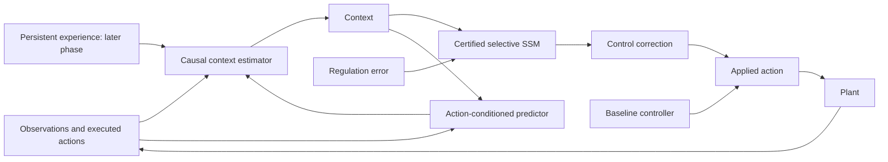

# Adaptive stable SSM: theory and experimental specification

Status: proposed design, with conditional mathematical results derived below.
Date: 2026-09-18.
Branch: `codex/experimental-adaptive-ssm`.
This document specifies the theory and experiments; it does not implement them.

The objective is a controller that learns useful structure across a family of
systems, adapts to changes from causal experience, and eventually retains useful
experience between deployments. The first milestone is adaptation to unseen
dynamics within a defined control family. Broad competence across unrelated tasks
requires additional data, representations, objectives, and evaluation; it is not
a consequence of stability or a larger hidden state alone.

The central design decision is to separate **learned inference about the task and
plant** from **the quantitative bounds on how that inference affects actuation**.
A context network may change its interpretation rapidly while a common storage
function bounds the resulting control correction. Persistent learning and
planning will use the same interface before we consider new action pathways.

## 1. What exists, and what needs to be added

The current code already provides:

- Selective diagonal recurrences with a per-step norm constraint in
  `src/neural_ssm/ssm/cells/selective/`.
- Deep residual composition and an explicit global decoder attenuation in
  `src/neural_ssm/ssm/layers.py`.
- Context-conditioned `select`, `gate`, and `mixer` ports in
  `src/neural_ssm/ssm/contextual.py`.
- Diagnostics for the bound and its attenuation through `gain_diagnostics()`.

The tank example trains a small error-driven controller against one frozen
identified plant, using constant references and finite horizons. Its main tracking
loss omits the first 40% of a rollout. Those choices are useful for that example
but do not define a training distribution for rapid adaptation or broad control.

The proposed additions are an explicit causal context state, an action-conditioned
prediction head, training across a plant family, and a declared lifecycle for
episodic state, persistent memory, and online parameter updates. A prediction head
is initially an auxiliary learning signal; it becomes a planning model only after
its multistep, action-conditioned accuracy has been evaluated.

The existing optional `context_encoder` is not automatically a causal recurrent
estimator. `ContextualDeepSSM.reset()` resets the core, not arbitrary state inside
a supplied encoder. The experimental wrapper must own these semantics explicitly.

## 2. Plant, signals, and causal architecture

Consider a sampled plant with possibly changing, hidden parameters:

\[
x_{t+1}=f_{\vartheta_t}(x_t,u_t,d_t),\qquad
y_t=g_{\vartheta_t}(x_t)+n_t.
\]

Here \(d_t\) is a disturbance, \(n_t\) is measurement noise, \(r_t\) is the
reference, and \(q_t\) contains the declared task objective and constraints.
Use \(e_t=y_t-r_t\), with the feedback sign handled by the controller.
The initial theory concerns regulation about a shared equilibrium. Tracking about
other equilibria and trajectories is an explicit extension, not implicit in this
notation.

At decision time \(t\), the agent has observed \(y_t\) and all executed actions
through \(u_{t-1}\). Define:

\[
\begin{aligned}
\epsilon_t &= y_t-\widehat y_{t\mid t-1},\\
h_t &= \Pi_{\mathcal H}F_\phi(h_{t-1},y_t,u_{t-1},r_t,q_t,\epsilon_t,m_t),\\
z_t &= Z_\phi(h_t,q_t),\\
v_t &= Q_\theta(e_t,z_t;s_t),\\
u_t &= u_\star(r_t)+K_0(y_t,r_t)+v_t.
\end{aligned}
\tag{1}
\]

\(s_t\) is the certified SSM state; \(h_t\) is the context-estimator state;
\(m_t\) is a read from persistent memory, absent in the first experiment and
later computed from available observations and the previous context state before
the update of \(h_t\).
\(\Pi_{\mathcal H}\) is projection to a compact state set, or an equivalent
bounded-state construction. This helps establish bounded auxiliary state; merely
clipping \(z_t\) would not establish bounded internal \(h_t\).

\(K_0\) is an independently stabilized baseline, potentially dynamic, including
any observer or integral state required by its design. \(u_\star\) supplies
equilibrium feedforward when needed. The learned SSM produces a residual \(v_t\).
For the first shared-equilibrium experiment, \(r_t=0\) and \(u_\star=0\).

The arrows involving prediction are temporally indexed: prediction
\(\widehat y_{t\mid t-1}\) was made before seeing \(y_t\). The next prediction
is made using the action actually executed at \(t\). There is no same-step
fixed-point solve between context, action, and observation.

Deployment inputs exclude future measurements, true plant parameters, and hidden
switch labels. Such information may appear in a clearly labeled oracle benchmark
or an offline supervision target, but never as an input to the deployed policy.
If an actuator or safety mechanism changes the proposed action, store the executed
action. Its effect on the closed-loop proof must also be included.

## 3. The central guarantee: arbitrary context under a fixed energy budget

This section derives a sufficient controller bound from the implemented selective
cell and residual structure. It is an original derivation for this design, not a
claim of a new theorem relative to the literature. Statements concern exact real
arithmetic; numerical implementations require tolerance checks and margins.

### 3.1 Common storage for one selective cell

For each coordinate of a `tv` or standard `tvc` cell, write

\[
\begin{bmatrix}s_{t+1}\\ \widehat o_t\end{bmatrix}
=
\underbrace{\begin{bmatrix}a_t&b_t\\ c_t&d_t\end{bmatrix}}_{M_t}
\begin{bmatrix}s_t\\ \gamma w_t\end{bmatrix},
\qquad \|M_t\|_2\le 1.
\tag{2}
\]

For `tv`, \(d_t=0\). The coordinates form a block diagonal operator. Let
\(w_t=W_{\rm in}p_t\), \(o_t=W_{\rm out}\widehat o_t\), with both projection
norms at most one. Normalizing the actual local matrix enforces (2). Therefore,
with \(V(s)=\|s\|^2\),

\[
V(s_{t+1})-V(s_t)+\|o_t\|^2\le\gamma^2\|p_t\|^2.
\tag{3}
\]

Summing for \(t=0,\ldots,T-1\) gives

\[
\sum_{t<T}\|o_t\|^2+V(s_T)
\le\gamma^2\sum_{t<T}\|p_t\|^2+V(s_0).
\tag{4}
\]

The same storage works for every admissible \(M_t\). Its entries may depend on
the input, causal history, context, or online-updated selector parameters. No bound
on the derivative of that dependence is needed for (3). Even a discontinuous
context decision preserves this energy inequality if its resulting matrix remains
admissible and the computation is well-defined.

The claim uses the **pre-update** state in the output of (2). The optional `tvc`
`output_uses_post_state=True` path changes the actual matrix to
\(\left[\begin{smallmatrix}a&b\\ca&cb+d\end{smallmatrix}\right]\).
The certificate above cannot be inferred from normalizing the original matrix for
that path. The experimental certified configuration will use the standard
pre-update output.

### 3.2 Common storage for the residual stack

For block \(i\), denote the fixed maximum residual scales by \(\alpha_i\) and
\(\beta_i\). The context gates \(G_{i,t},H_{i,t}\) are diagonal contractions:

\[
q_t=p_t+\alpha_iG_{i,t}o_t,\qquad
p_t^+=q_t+\beta_iH_{i,t}\mathcal F_i(q_t).
\tag{5}
\]

Assume \(\mathcal F_i(0)=0\), \(\|\mathcal F_i(q)\|\le L_i\|q\|\), and
dropout is disabled. Per-channel residual scales can be included in the gates
after taking their largest magnitude as \(\alpha_i\) or \(\beta_i\).

For \(\gamma_i>0\), define

\[
c_i=\alpha_i(\alpha_i+1/\gamma_i),\quad
\ell_i=1+\beta_iL_i,\quad
\kappa_i=\ell_i(1+\alpha_i\gamma_i),\quad
W_i=\ell_i^2c_iV_i.
\tag{6}
\]

Young's inequality and (3) yield

\[
\|q_t\|^2+c_i\Delta V_i
\le(1+\alpha_i\gamma_i)^2\|p_t\|^2,
\qquad
\|p_t^+\|^2+\Delta W_i\le\kappa_i^2\|p_t\|^2.
\tag{7}
\]

For example, the first inequality follows by bounding the cross term with
\(2\alpha_i\|p_t\|\|o_t\|\le
\alpha_i\gamma_i\|p_t\|^2+(\alpha_i/\gamma_i)\|o_t\|^2\).
This also explains why the storage weights must stay fixed over the trajectory.

Let the encoder and decoder be contractions, and let \(\sigma\) be the fixed
decoder attenuation used at deployment. Cascading \(N\) blocks gives

\[
V_Q=\sigma^2\sum_{i=1}^N
\left(\prod_{j=i+1}^N\kappa_j^2\right)W_i,
\qquad
\Gamma=\sigma\prod_{i=1}^N\kappa_i,
\tag{8}
\]

and \(\Delta V_Q+\|f_t\|^2\le\Gamma^2\|e_t\|^2\), where \(f_t\) is the
decoded feature signal. The current smooth decoder cap ensures \(\Gamma\) does
not exceed its configured global target for the frozen deployment parameters.

For a context mixer \(v_t=A_t f_t\) satisfying \(\|A_t\|_2\le m\), multiply
the storage by \(m^2\). Then, with \(\overline V_Q=m^2V_Q\) and
\(\gamma_Q=m\Gamma\),

\[
\boxed{
\sum_{t<T}\|v_t\|^2+\overline V_Q(s_T)
\le\gamma_Q^2\sum_{t<T}\|e_t\|^2+\overline V_Q(s_0).
}
\tag{9}
\]

Without a mixer set \(m=1\). A confidence multiplier in \([0,1]\) is another
contraction and can attenuate this output without increasing the bound.

**Result.** The certified controller retains a uniform zero-state induced
\(\ell_2\) gain bound under arbitrary causal context, including context produced
by an adapting learner, provided the assumptions above continue to hold.
For nonzero state, (9) supplies the initial storage term. A chunk of a continuing
trajectory is not a fresh zero-state experiment.

### 3.3 Scope of the result

Equation (9) does not establish an incremental bound
\(\|Q(e)-Q(\widetilde e)\|\le\gamma_Q\|e-\widetilde e\|\).
Two inputs can select different matrices and gates. It also does not establish
constraint satisfaction, optimal tracking, monotonic learning, accurate system
identification, or bounded internal state of an unrestricted context learner.

Additive `input` context is excluded from this result's disturbance-only gain.
If an additive channel \(\zeta\) is used, the bound is instead on the joint input
\([e;\zeta]\), with energy \(\|e\|^2+\|\zeta\|^2\). An endogenous additive
context must be included in the feedback analysis. A bounded constant sequence is
not an infinite-horizon \(\ell_2\) signal, and differencing an arbitrarily
switching bounded sequence does not necessarily make it \(\ell_2\).

## 4. From controller energy to a closed-loop guarantee

Analyze the **plant plus baseline controller** as an interconnection
\(R:v\mapsto e\), with external signals \(\xi\) including disturbances and
appropriate reference deviations. Suppose the baseline interconnection is
well-posed and internally stable, and the combined \(R\)-\(Q\) feedback is also
causally well-posed. The strictly causal plant convention in Section 2 supplies
the latter condition for the stated architecture. Uniformly over the admitted
plant family and allowed parameter changes, assume every finite horizon satisfies

\[
\|e\|_T\le g_R\|v\|_T+g_\xi\|\xi\|_T+b_R(\chi_0),
\qquad
\|v\|_T\le\gamma_Q\|e\|_T+b_Q(s_0),
\tag{10}
\]

Here \(\chi_0\) includes the initial plant, baseline controller, and observer
states, and \(b_Q=\sqrt{\overline V_Q(s_0)}\) is a sufficient choice from (9).
All constants are independent of \(T\) and context. If
\(g_R\gamma_Q<1\), substitution gives

\[
\boxed{
\|e\|_T\le
\frac{g_\xi\|\xi\|_T+b_R(\chi_0)+g_Rb_Q(s_0)}
{1-g_R\gamma_Q}.
}
\tag{11}
\]

This is the proposed sufficient closed-loop finite-gain argument. Internal plant
state claims additionally rely on the baseline interconnection's internal-state
properties; auxiliary learning state must be bounded separately. For the nonlinear
family, a local bound is valid only while the trajectory remains in its certified
domain; invariance cannot be assumed from a gain estimate alone.

Using the residual port of an already stabilized system can be less restrictive
than imposing a small-gain product on the entire plant and learned controller.
Whether it is less conservative in a specific system must be measured or derived.

### Plant uncertainty and switching

The required \(g_R\) is a bound for the actual admitted closed-loop family, not
just an identified nominal model. If a separately justified residual-port mismatch
satisfies \(\|R(v)-\widehat R(v)\|_T\le\delta_R\|v\|_T\) in the relevant
zero-state setting, then \(g_R\le\widehat g_R+\delta_R\) follows by the triangle
inequality. Other uncertainty structures need their own interconnection analysis.
Prediction RMSE and ensemble disagreement are not deterministic \(\delta_R\)
certificates. Separate frozen-plant bounds do not establish a bound under arbitrary
switching; require a common storage argument or specified switching conditions.

### Tracking, saturation, and constraints

A stable zero-preserving error-only map generally cannot supply arbitrary
equilibrium actuation once error and controller transients vanish. Use equilibrium
feedforward and/or a separately analyzed baseline with integral action. Tracking a
nonzero reference requires coordinates and bounds about that equilibrium or
trajectory; the selective core's zero-state bound is not automatically an
incremental tracking bound.

Symmetric saturation of the correction alone is a pointwise contraction and can
be incorporated before the residual port in (10). Saturating the **total** action
can alter the baseline interconnection and must be included in its analysis.
Input clipping does not establish state constraints. A later predictive safety
filter would require its own model-error assumptions, feasible backup policy,
and recursive-feasibility argument; see [the primary safety-filter paper](https://arxiv.org/abs/1812.05506).

## 5. What is allowed to learn online

First train all relevant networks offline, then declare a deployment parameter
partition. The initial implementation freezes the certified core's parameters,
per-layer gains, residual scales, projection bounds, decoder cap, and baseline.

| Object | First experiment | Later persistent-learning phase |
| --- | --- | --- |
| Certified SSM state \(s_t\) | Evolves each step | Evolves; never overwritten by retrieved memory |
| Context state \(h_t\) | Evolves causally in a bounded set | Evolves; initialization may use declared persistent memory |
| Context encoder parameters \(\phi\) | Fixed at deployment | Small projected adapter may update |
| Prediction model parameters \(\psi\) | Fixed at deployment | Candidate updates from observed transitions |
| Episodic memory bank | Absent | Bounded capacity and bounded stored representations |
| Selector/gate/mixer network weights | Fixed at deployment | Updates can satisfy (9) if all enforced bounds stay fixed |
| Core gains, residual base scales, storage weights | Fixed | Require a new proof or fixed uniform envelope before updates |
| Baseline controller and gain certificate | Fixed | Re-analyze the plant interconnection before changes |

Some normalized cell parameters could be updated while preserving the same local
storage. That is broader than the initial implementation needs. Start with the
smallest auditable update set: auxiliary model and context adapter. Do not infer
that all core weight updates are invalid; distinguish admissible common-storage
updates from unproved updates.

In particular, recomputing a global decoder cap after changing layer gains does
not account for energy stored under old gains. A storage \(V_{\theta_t}\) that
depends on updated parameters introduces an extra parameter-change term when
telescoping. Equation (9) avoids this by fixing its storage and envelopes.

Likewise, loading a remembered nonzero controller state injects storage energy.
Persistent memory should initially affect context only, so a zero core input and
zero core state still produce zero correction regardless of memory contents.

## 6. Learning objectives and memory

### Offline learning across tasks

Sample systems, objectives, initial states, noise, disturbances, and change times
from a declared training distribution. Train on causal closed-loop rollouts using

\[
\mathcal L_{\rm control}=
\mathbb E\left[\sum_{t<T}
e_t^\top Q_e e_t+(u_t-u_\star)^\top R_u(u_t-u_\star)
+(u_t-u_{t-1})^\top S_u(u_t-u_{t-1})
+\ell_{\rm constraint}(x_t,u_t)\right].
\tag{12}
\]

The matrices are task-dependent positive semidefinite cost weights, not the
controller map \(Q_\theta\). Constraint penalties measure and discourage
violations; they do not prove their absence. Include the full transient and
predeclare post-change evaluation windows rather than dropping a fixed prefix.

Add an action-conditioned prediction head
\(\widehat y_{t+1\mid t}=M_\psi(h_t,z_t,y_t,u_t)\) and optionally

\[
\mathcal L_{\rm pred}=
\sum_{t,k=1}^{H_p}\omega_k
\|\widehat y_{t+k\mid t}(u_{t:t+k-1})-y_{t+k}\|^2.
\tag{13}
\]

For multistep training predictions, roll the model forward without giving it
future observations. Historical executed action sequences can be used as training
inputs; deployment rollouts use proposed actions. A single causal state encoder
may support both tasks. Begin with a one-step head and compare control-only
against control-plus-prediction learning: predicting everything well need not
produce a better policy representation.

Use varied action data where identification is needed. A controller can generate
poorly exciting, confounded data; low on-policy prediction error is not proof that
the model can distinguish plant parameters or evaluate new action sequences.
Any online probing is an explicit additional input with an energy/constraint
budget, not an unaccounted additive action from the context network.

### Episodic adaptation versus persistent learning

Episodic adaptation changes \(h_t,z_t,s_t\) while weights stay fixed. Train the
encoder to extract useful information from experience; it need not recover a
unique physical parameter vector. Lack of excitation or observability can make
such recovery impossible. [Rapid Motor Adaptation](https://arxiv.org/abs/2107.04034)
is a relevant precedent for learning a policy-conditioning adaptation mechanism.

For persistent parameter learning, let \(\omega\) include only the approved
auxiliary parameters or adapter. A candidate update may take the form

\[
\omega^+=\Pi_\Omega\left[\omega-\eta\nabla_\omega
\left(\mathcal L_{\rm recent}
+\lambda_{\rm replay}\mathcal L_{\rm replay}
+\lambda_{\rm anchor}\|\omega-\omega_{\rm accepted}\|^2\right)\right].
\tag{14}
\]

\(\Omega\) is a compact allowed parameter set. This bounds parameter magnitude
and helps numerics; a small change relative to the accepted parameters requires
an additional trust-region or step-size constraint. Neither establishes better
control or freedom from forgetting.
Use actual observed transitions as supervision; predicted outcomes cannot certify
their own accuracy. Replay contains earlier regimes with a declared sampling rule.

When learning the update mechanism or its initialization, train on a support
history and evaluate the resulting policy on a later query segment. This produces
an adaptation objective such as

\[
\min_{\theta,\phi,\omega_0}
\mathbb E_{\mathcal T}\left[
J_{\mathcal T}^{\rm query}
\big(Q_\theta,Z_\phi,U(\omega_0,D_{\mathcal T}^{\rm support})\big)
\right].
\tag{15}
\]

Support data must precede the decisions they inform. A recurrent encoder trained
end to end is a simpler initial version; differentiating through weight updates
is a later option. [TTT](https://arxiv.org/abs/2407.04620) and
[Titans](https://arxiv.org/abs/2501.00663) motivate expressive adaptive memory in
sequence models, but neither supplies the closed-loop guarantee in (11).

Promote a candidate using separate validation evidence for control cost,
retention, and numerical behavior. Keep the previous accepted version and an
explicit state/reset policy for rollback. In simulation we can evaluate paired
control rollouts before promotion. Logged real-world transitions alone generally
cannot establish counterfactual policy improvement; that requires additional
off-policy assumptions or controlled evaluation. No claim of monotonic deployment
improvement is made here.

## 7. Planning as a later extension

After action-conditioned predictions are useful, use additional inference time to
compare future trajectories. The first planning variant chooses an admissible
sequence of context commands \(c_{t:t+H-1}\), which modulate the same bounded
ports rather than bypassing them with an arbitrary actuator command:

\[
\min_{c_{t:t+H-1}}
\sum_{k=0}^{H-1}\ell(\widehat x_{t+k},\widehat u_{t+k},q_{t+k})
+\widehat V_f(\widehat x_{t+H})
+\lambda_{\rm unc}\mathcal U(\widehat\tau),
\tag{16}
\]

subject to the learned rollout model and
\(\widehat v_{t+k}=Q_\theta(\widehat e_{t+k},Z(h,c_{t+k});\widehat s_{t+k})\).
Only the first command is applied, then measurements update the next plan.
All candidate simulations start from copies of state and must not mutate the
live controller. Model uncertainty penalties are heuristics unless calibrated
under additional assumptions. Planning through arbitrary causal context preserves
the controller-side bound (9), but better performance depends on model quality and
the context ports' achievable actions.

Direct action MPC, learned feedforward, and arbitrary subgoal/reference changes
are possible subsequent designs. Their additional input paths require explicit
analysis; they are not covered merely because an SSM remains in the loop.
[TD-MPC2](https://arxiv.org/abs/2310.16828) motivates learned-model planning across
tasks; its performance evidence is distinct from this proposed certificate.

## 8. First experiment with an analytical plant-family bound

Use the scalar, fully observed, shared-equilibrium family

\[
x_{t+1}=a_t x_t+b_tu_t+d_t,\qquad y_t=x_t,
\quad a_t\in[0.5,1.05],\quad b_t\in[0.8,1.2].
\tag{17}
\]

Choose the fixed baseline \(u_t=-0.5x_t+v_t\). Then

\[
x_{t+1}=(a_t-0.5b_t)x_t+b_tv_t+d_t,
\qquad |a_t-0.5b_t|\le0.65.
\tag{18}
\]

This bound holds under arbitrary parameter switching, because it uses a common
absolute-value contraction. A geometric convolution envelope and the
\(\ell_1\)-to-\(\ell_2\) convolution bound give

\[
g_R\le\frac{1.2}{1-0.65}=\frac{24}{7},\qquad
g_d\le\frac{1}{1-0.65}=\frac{20}{7}.
\tag{19}
\]

For example, \(\gamma_Q=0.2\) gives
\(g_R\gamma_Q\le24/35\approx0.686<1\). This is a derived sufficient budget
for this specific example, not a recommended universal hyperparameter. The true
induced gain may be smaller. Larger budgets need a tighter proof or must be
clearly labeled uncertified comparisons.

For nonzero plant initial state, an explicit valid offset completing (10) is
\(b_R(x_0)=|x_0|/\sqrt{1-0.65^2}\), obtained by summing the squared geometric
envelope of the homogeneous response. The controller initial storage is accounted
for separately by \(b_Q\).

The family includes open-loop unstable cases and changing input effectiveness.
Maintain the physical state through a parameter switch. Use varied initial
conditions and finite-energy disturbances so changes occur while there is enough
signal to reveal them. Switching parameters after the state has settled exactly
to zero creates no observable evidence and no meaningful adaptation challenge.

Start without saturation or measurement noise to isolate the theorem. Later
noise enters as an additional external input; if the baseline uses noisy
measurements its contribution must appear in the bound. Persistent stochastic
noise generally has infinite total energy: use finite-horizon or
stochastic performance statements, not convergence claims from an \(\ell_2\)
theorem. Action clipping, nonlinear tanks, partial observation, and reference
tracking are subsequent tests with their own declared assumptions.

### Training and evaluation protocol

1. Sample stationary episodes and episodes with one hidden, randomized switch.
   Keep parameter combinations, trajectories, and random seeds separate across
   training, validation, and locked test sets.
2. Train all learned comparators on the same broader distribution. Compare the
   baseline, a current-size SSM, a capacity-matched larger SSM, learned context
   through `select` only, and that context model plus the prediction objective.
3. Add zero/frozen-context and true-parameter oracle-context controls. Oracle
   information is an upper-reference diagnostic, not a deployable competitor.
4. Give learned comparisons the same available information and actuation envelope.
   If an alternative accepts extra additive observation/action inputs, derive its
   joint-input feedback bound or label the comparison empirical. Equal numeric
   gamma values on different input ports are not equal robustness guarantees.
5. Evaluate repeated changes and horizons 5-10 times longer than training. Report
   no-change behavior and out-of-training parameter combinations separately from
   behavior outside the certified parameter envelope.
6. Use paired evaluation episodes and at least five training seeds for substantive
   performance conclusions. A small smoke run verifies execution only. Match and
   report parameter count and latency separately, with equal tuning effort.

Measure full-episode and fixed post-change integrated error, control effort,
recovery time, upper-tail cost, peak state, prediction accuracy, inference latency,
and memory. Evaluate prediction both on policy and under held-out, independently
varied action sequences. Count nonrecovering runs explicitly. Include certificate diagnostics,
decoder attenuation, and finite-horizon energy residuals with the correct initial
storage term. Numerical energy tests can reveal implementation mistakes; passing
them does not prove a universal inequality.

Predeclare practical improvement and acceptable nominal regression thresholds
using the task's units before the substantive run. The adaptation hypothesis is
supported only if learned context improves held-out post-change control beyond a
larger ordinary SSM, under an equivalent information and robustness envelope.
If oracle context helps but inferred context does not, improve inference/training.
If oracle context also fails, investigate control authority, representation, or
the bound before adding a more complex learner.

Persistent learning is a separate experiment: use an ordered sequence such as
\(A\to B\to C\to A\), compare fresh-start, retained-memory, and parameter-update
variants, and evaluate frozen probe sets without training on them. Report speed
of reacquisition and backward transfer as well as immediate improvement.

## 9. Implementation contract for the experimental branch

Implementation will follow this document in small stages:

| Stage | Deliverable | Evidence required before the next stage |
| --- | --- | --- |
| A | Explicit context/core/predictor state wrapper; scalar plant family | Causality, state lifecycle, and finite-horizon energy checks |
| B | Offline multi-plant training with `select` context; optional prediction head | Paired held-out adaptation results and ordinary-SSM comparison |
| C | Bounded persistent memory, then a small auxiliary online adapter | Acquisition/retention results and no violated interface assumptions |
| D | Action-conditioned multistep model and context-command planning | Model validation and control benefit at a stated latency budget |
| E | More demanding plants, tracking, and less conservative certificates | New plant/interface assumptions and corresponding proof obligations |

The wrapper should expose a conceptual `step(observation, task, state)` operation
returning the proposed action, next explicit state, and diagnostics. Record the
executed action when it becomes known. State contains separate controller,
context, predictor, and previous-action fields; later persistent memory and
optimizer state are separate, versioned objects. Physical episode reset, context
reset, and persistent-memory erase are different operations.

Initialize the core to zero and the context to a declared point in its bounded
state set. Set the previous action to the known pre-episode actuation (zero in
the initial regulation experiment). Use \(\epsilon_0=0\) with an explicit
"no previous prediction" mask, or use a declared causal warmup; do not treat an
arbitrary zero prediction as a real prediction error. Finalize
\(\widehat y_{t+1\mid t}\) after the executed \(u_t\) is known.

The first configuration uses `param="tv"`, a supported bounded feedforward,
`context_modes=("select",)`, fixed prescribed gamma, `learn_x0=False`, and no
dropout at deployment. Add `gate` and `mixer` one at a time as ablations. Use
exact norm enforcement, not an approximate power-iteration estimate presented
as a hard bound. Freeze deployment parameters explicitly; `train_gamma=True`
during offline training does not authorize online gamma changes.

The history estimator and the plant/controller feedback are causal and sequential.
Offline known sequences may admit parallel scans, but a closed-loop rollout must
not precompute context from future measurements. Reset neither controller nor
context state at hidden switches. Truncated backpropagation detaches history;
it must not silently reset physical or agent state.

Required implementation checks include chunked versus unchunked state equivalence,
future-observation noninterference, zero correction for zero core input/state
under arbitrary context, per-step local norm and storage inequalities, and
adversarial context switches. Test permitted parameter changes with a live state
when persistent learning is introduced. Parameter-derived caches and compiled
paths must be audited for approved online mutations; the current bounded linear
layer caches effective weights in eval mode, which reinforces freezing core
projections in the initial design.

## 10. Questions the experiments should resolve

- Does context infer distinctions that actually change the best control action?
- Is the bottleneck insufficient information, memory, optimization, or a small
  correction budget imposed by the certificate?
- Does predictive supervision help adaptation without sacrificing task cost?
- Does persistent experience accelerate reacquisition without harming prior tasks?
- Does extra planning compute improve decisions at an acceptable control rate?
- Can a tighter plant/stack certificate recover useful authority while preserving
  the required guarantee?

The theory establishes a conditional way to preserve an energy bound while
learning through context. Capability gains and persistent improvement remain
empirical hypotheses to be tested under this specification.
